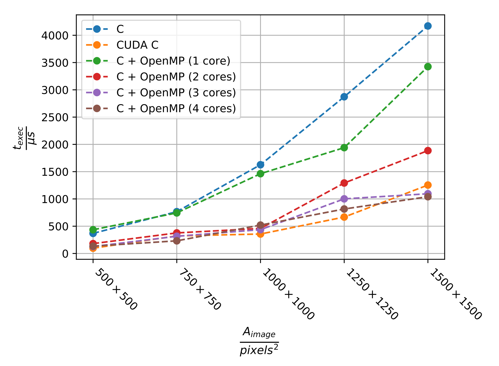

# Parallel K-Means Clustering

  

## Introduction

This is a collection of implementations of the k-means clustering algorithm
using OpenCV, pure C, C + OpenMP and C + CUDA. All implementations can be
applied to a sample image and compared via a benchmark program and accompanying
visualization script. A complete lab report (in German) can be found under
`submodule/report/pdf/`.

## Building and Running

Run `make demo` preview the different implementations (results should be
identical or at least very similar, you will need a C compiler supporting
OpenMP 4.5, an installation of OpenCV 3 and an NVIDIA GPU with appropriate
compute capability).

Running `make benchmark` will re-generate the .csv files under `benchmarks`
(they must be removed beforehand). For example, on my machine, both OpenMP and
CUDA yield a significant speedup over the naive C implementation:

  

